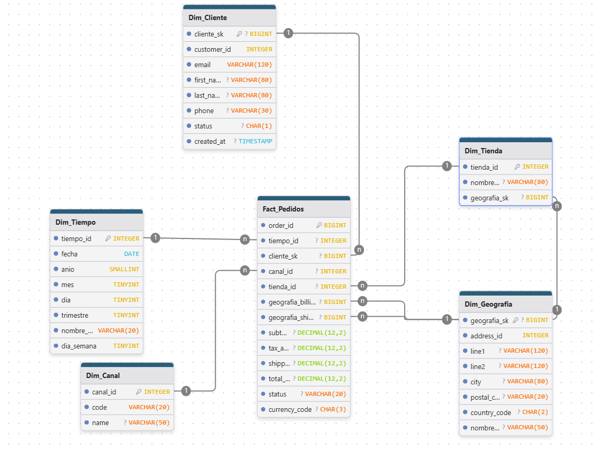

# Trabajo Práctico Final — Introducción al Marketing Online y los Negocios Digitales

# 🧪 TP Final — Mini–Ecosistema de Datos & Dashboard Comercial (EcoBottle)

Este trabajo implementa un mini–ecosistema de datos comercial con fuentes online y offline, un **modelo en estrella** y un **dashboard** con KPIs clave: **Ventas**, **Usuarios Activos**, **Ticket Promedio**, **NPS**, **Ventas por Provincia** y **Ranking Mensual por Producto** :contentReference[oaicite:0]{index=0}. Se parte de tablas RAW provistas y se construyen **dimensiones y hechos** junto con un **DW en CSV** consumido por Looker Studio :contentReference[oaicite:1]{index=1} :contentReference[oaicite:2]{index=2}.

---

## 📌 1. Objetivo y Alcance

- **Objetivo:** diseñar e implementar el ecosistema de datos y el dashboard comercial con los KPIs solicitados :contentReference[oaicite:3]{index=3}.  
- **Alcance del caso:** EcoBottle AR opera ventas **online** y **offline**; se registran pedidos, pagos, envíos, sesiones web y respuestas de NPS. La gerencia monitorea ventas, ticket, usuarios, NPS y ranking mensual por producto, con foco por producto, provincia y canal :contentReference[oaicite:4]{index=4}.

---

## 📖 2. Diccionario de Datos y Modelo  
> Esta sección ya existe en el repositorio. No se reproduce aquí por pedido expreso.

---

## 🏗️ 3. Arquitectura de Datos

1. **RAW/**: CSV fuente del repositorio base.  
2. **Transformaciones (Python)**: limpieza, normalización y cálculo de KPIs para publicar **DW/** en CSV :contentReference[oaicite:5]{index=5}.  
3. **DW/**: tablas **denormalizadas** listas para BI; se construyen **todas las dimensiones y hechos posibles** más allá del mínimo del tablero :contentReference[oaicite:6]{index=6}.  
4. **Dashboard**: Looker Studio conectado a **DW/**, con filtros y vistas mínimas requeridas :contentReference[oaicite:7]{index=7}.

---

## 🧱 4. Modelo Estrella (visión general)

- **Dimensiones:** Tiempo, Producto, Cliente, Geografía (Provincia/Dirección), Canal, Tienda.  
- **Hechos:** Pedidos, Ventas Detalle, Pagos, Envíos, Sesiones, NPS.  

> Las entidades y campos base están definidos en la consigna: catálogos, maestros, transaccionales, actividad digital y NPS :contentReference[oaicite:8]{index=8} :contentReference[oaicite:9]{index=9} :contentReference[oaicite:10]{index=10} :contentReference[oaicite:11]{index=11}.

---

## 🔧 5. Proceso de Construcción (cómo se hizo)

### 5.1 Dimensión de Tiempo (`Dim_Tiempo`)
Se generó de forma programática para cubrir el rango operativo del dataset. Columnas típicas:
- `date_key` (YYYYMMDD), `date`, `year`, `quarter`, `month_number`, `month_name`, `week_number`, `day_of_month`, `day_of_week`, `is_weekend`.  
- Se usa como clave de tiempo en todos los hechos con fechas (`order_date`, `paid_at`, `responded_at`, etc.).  
- Permite **slicing** consistente en el tablero por período.

> La dimensión de tiempo no viene en RAW y se crea para habilitar agregaciones temporales y las vistas del dashboard en Looker Studio :contentReference[oaicite:12]{index=12}.

### 5.2 Dimensiones de Negocio
- **Producto (`Dim_Producto`)**: derivada de `product` y `product_category`; incluye SKU, nombre, categoría y estado. Se crean surrogate keys (SK) y se resuelven faltantes con un registro “Desconocido” para asegurar integridad referencial :contentReference[oaicite:13]{index=13}.  
- **Cliente (`Dim_Cliente`)**: deriva de `customer` con estado y fecha de alta; se contempla anonimato en sesiones/NPS donde `customer_id` puede ser nulo :contentReference[oaicite:14]{index=14} :contentReference[oaicite:15]{index=15}.  
- **Geografía (`Dim_Geografia`)**: combina `address` con `province` para soportar el KPI “Ventas por Provincia” y mapas :contentReference[oaicite:16]{index=16}.  
- **Canal (`Dim_Canal`)**: normaliza `channel` para clasificar pedidos, sesiones y NPS (ONLINE/OFFLINE) :contentReference[oaicite:17]{index=17}.  
- **Tienda (`Dim_Tienda`)**: proveniente de `store`, enlazada a `address` para canal offline :contentReference[oaicite:18]{index=18}.

Tratamientos comunes:
- Deduplicación por claves naturales.  
- Normalización de códigos y dominios.  
- Surrogate keys y registro “-1 Desconocido” donde aplique.

### 5.3 Hechos (grano, llaves y reglas)
- **Fact_Pedidos**  
  - **Grano:** 1 fila por `order_id`.  
  - **Claves:** tiempo (`order_date_key`), cliente, canal, tienda (si aplica), geografía de envío.  
  - **Métricas:** `subtotal`, `tax_amount`, `shipping_fee`, `total_amount`.  
  - **Reglas:** se filtran estados para KPIs de ventas/ticket con `status IN ('PAID','FULFILLED')` :contentReference[oaicite:19]{index=19} :contentReference[oaicite:20]{index=20}.  

- **Fact_Ventas_Detalle**  
  - **Grano:** 1 fila por `order_item_id`.  
  - **Claves:** pedido, producto, tiempo.  
  - **Métricas:** `quantity`, `unit_price`, `discount_amount`, `line_total` (quantity*unit_price - discount) :contentReference[oaicite:21]{index=21}.  
  - **Uso:** ranking mensual por producto y análisis mix de ventas :contentReference[oaicite:22]{index=22}.

- **Fact_Pagos**  
  - **Grano:** 1 fila por `payment_id`.  
  - **Claves:** pedido, tiempo de pago, método.  
  - **Métricas:** `amount`; estados soportan conciliación vs. ventas :contentReference[oaicite:23]{index=23}.

- **Fact_Envios**  
  - **Grano:** 1 fila por `shipment_id`.  
  - **Claves:** pedido, tiempo de eventos logísticos, carrier.  
  - **Uso:** trazabilidad y tiempos de entrega :contentReference[oaicite:24]{index=24}.

- **Fact_Sesiones**  
  - **Grano:** 1 fila por `session_id`.  
  - **Claves:** cliente (opcional), canal/fuente, tiempo de inicio.  
  - **Uso:** “Usuarios Activos” por período, con fallback a sesiones anónimas cuando no hay `customer_id` :contentReference[oaicite:25]{index=25} :contentReference[oaicite:26]{index=26}.

- **Fact_NPS**  
  - **Grano:** 1 fila por respuesta `nps_id`.  
  - **Claves:** cliente (opcional), canal, tiempo de respuesta.  
  - **Uso:** cálculo de NPS por período y canal :contentReference[oaicite:27]{index=27} :contentReference[oaicite:28]{index=28}.

---

## 🗂️ 6. Estructura del Repositorio

## 📖 2. Diccionario de Datos y Modelo

A continuación, se detalla el Esquema Estrella (modelo Kimball) diseñado para este proyecto. Se definen los supuestos clave, las dimensiones de conformación y las tablas de hechos que almacenarán las métricas del negocio.

### Supuestos y Decisiones de Modelado

1.  **Claves (Keys):**
    * **Surrogate Keys (SK):** Se generan claves sustitutas (ej: `cliente_sk`, `producto_sk`) para las dimensiones principales (`Dim_Cliente`, `Dim_Producto`, `Dim_Geografia`). Esto permite manejar cambios a lo largo del tiempo (Slowly Changing Dimensions) y desvincular el DW de las claves operacionales de `RAW`.
    * **Business Keys (BK):** Se conservan las claves originales (ej: `customer_id`, `product_id`) como atributos en las dimensiones para trazabilidad y referencia.
    * **Fact Keys:** Las tablas de hechos usan las PK originales del sistema `RAW` (ej: `order_id`, `session_id`) como su propia Primary Key, ya que el grano es el mismo.

2.  **Dimensión de Tiempo (`Dim_Tiempo`):**
    * Esta es una **dimensión de conformación** generada por el script de ETL, ya que no existe en los datos `RAW`.
    * Todas las tablas de hechos se vinculan a esta dimensión a través de sus respectivos campos de fecha (ej: `order_date`, `started_at`, `paid_at`).
    * La PK (`tiempo_id`) es un entero con formato `YYYYMMDD` para facilitar los `JOINs`.

3.  **Manejo de Nulos / Anónimos:**
    * Las tablas `web_session` y `nps_response` permiten un `customer_id` nulo.
    * Para manejar esto, `Dim_Cliente` contendrá un registro especial (ej: `cliente_sk = -1` o `0`) con el valor "Cliente Desconocido / Anónimo". Las FKs en `Fact_Sesiones` y `Fact_NPS` apuntarán a este registro cuando el `customer_id` sea `NULL`.

4.  **Denormalización en Dimensiones:**
    * **`Dim_Producto`:** Se denormaliza uniendo `product` con `product_category` para incluir el nombre de la categoría y su padre en la misma fila.
    * **`Dim_Geografia`:** Se denormaliza uniendo `address` con `province` para tener la información de provincia directamente en la dimensión geográfica.

5.  **Definición de KPIs (Dominios):**
    * **Ventas ($M):** Se calculan como `SUM(total_amount)` de `Fact_Pedidos` donde el `status` sea 'PAID' o 'FULFILLED'.
    * **Usuarios Activos (nK):** `COUNT(DISTINCT cliente_sk)` de `Fact_Sesiones`. Se excluye al cliente "Desconocido".
    * **Ticket Promedio (\$K):** `SUM(total_amount) / COUNT(DISTINCT order_id)` para los pedidos con status 'PAID' o 'FULFILLED'.
    * **NPS (ptos.):** `((Promotores - Detractores) / Total Respuestas) * 100`. (Promotores: 9-10, Detractores: 0-6).

---

### DIMENSIONES (Dims)

Estas tablas describen el contexto ("quién, qué, dónde, cuándo") de los hechos.

#### Dim_Tiempo
* **PK:** `tiempo_id` (INT)
* **Atributos:** `fecha` (DATE), `anio` (SMALLINT), `mes` (TINYINT), `nombre_mes` (VARCHAR), `dia` (TINYINT), `trimestre` (TINYINT), `dia_semana` (TINYINT).

#### Dim_Cliente
* **PK:** `cliente_sk` (BIGINT AUTO_INCREMENT)
* **Atributos:** `customer_id` (INT, Business Key), `email` (VARCHAR), `first_name` (VARCHAR), `last_name` (VARCHAR), `phone` (VARCHAR), `status` (CHAR), `created_at` (TIMESTAMP).

#### Dim_Geografia
* **PK:** `geografia_sk` (BIGINT AUTO_INCREMENT)
* **Atributos:** `address_id` (INT, Business Key), `line1` (VARCHAR), `line2` (VARCHAR), `city` (VARCHAR), `postal_code` (VARCHAR), `country_code` (CHAR), `nombre_provincia` (VARCHAR).

#### Dim_Producto
* **PK:** `producto_sk` (BIGINT AUTO_INCREMENT)
* **Atributos:** `product_id` (INT, Business Key), `sku` (VARCHAR), `nombre_producto` (VARCHAR), `list_price` (DECIMAL), `status_producto` (CHAR), `nombre_categoria` (VARCHAR), `nombre_categoria_padre` (VARCHAR).

#### Dim_Canal
* **PK:** `canal_id` (INT)
* **Atributos:** `code` (VARCHAR), `name` (VARCHAR).

#### Dim_Tienda
* **PK:** `tienda_id` (INT)
* **FK:** `geografia_sk` (ref: `Dim_Geografia.geografia_sk`)
* **Atributos:** `nombre_tienda` (VARCHAR).

---

### HECHOS (Facts)

Estas tablas registran los procesos de negocio y sus métricas. La consigna pide crear todas las tablas de hechos posibles.

#### 1. Fact_Pedidos
Registra las cabeceras de las órdenes de venta. Es la fuente principal para el KPI de Ventas Totales y Ticket Promedio.

* **Grano:** Una fila por cabecera de pedido (`sales_order`).
* **Dimensiones (FKs):**
    * `tiempo_id` (ref: `Dim_Tiempo`, por `order_date`)
    * `cliente_sk` (ref: `Dim_Cliente`)
    * `canal_id` (ref: `Dim_Canal`)
    * `tienda_id` (ref: `Dim_Tienda`, NULO si es online)
    * `geografia_billing_sk` (ref: `Dim_Geografia`, por `billing_address_id`)
    * `geografia_shipping_sk` (ref: `Dim_Geografia`, por `shipping_address_id`)
* **Medidas:** `subtotal`, `tax_amount`, `shipping_fee`, `total_amount`.
* **Atributos Degenerados:** `order_id` (PK), `status`, `currency_code`.

#### 2. Fact_Ventas_Detalle
Registra el detalle de productos en cada orden. Es la fuente para el Ranking de Productos.

* **Grano:** Una fila por ítem de producto dentro de un pedido (`sales_order_item`).
* **Dimensiones (FKs):**
    * `order_id` (ref: `Fact_Pedidos.order_id`)
    * `producto_sk` (ref: `Dim_Producto`)
    * `tiempo_id` (ref: `Dim_Tiempo`, por `order_date` de la cabecera)
* **Medidas:** `quantity`, `unit_price`, `discount_amount`, `line_total`.
* **Atributos Degenerados:** `order_item_id` (PK).

#### 3. Fact_Pagos
Registra las transacciones de pago asociadas a las órdenes.

* **Grano:** Una fila por transacción de pago (`payment`).
* **Dimensiones (FKs):**
    * `order_id` (ref: `Fact_Pedidos.order_id`)
    * `tiempo_id` (ref: `Dim_Tiempo`, por `paid_at`)
* **Medidas:** `amount`.
* **Atributos Degenerados:** `payment_id` (PK), `method`, `status`, `transaction_ref`.

#### 4. Fact_Envios
Registra la información logística de los envíos.

* **Grano:** Una fila por envío (`shipment`).
* **Dimensiones (FKs):**
    * `order_id` (ref: `Fact_Pedidos.order_id`)
    * `tiempo_shipped_id` (ref: `Dim_Tiempo`, por `shipped_at`)
    * `tiempo_delivered_id` (ref: `Dim_Tiempo`, por `delivered_at`)
* **Medidas:** `dias_en_transito` (Calculada en ETL: `delivered_at` - `shipped_at`).
* **Atributos Degenerados:** `shipment_id` (PK), `carrier`, `tracking_number`, `status`.

#### 5. Fact_Sesiones
Registra las sesiones de navegación web. Es la fuente para el KPI de Usuarios Activos.

* **Grano:** Una fila por sesión web (`web_session`).
* **Dimensiones (FKs):**
    * `cliente_sk` (ref: `Dim_Cliente`, puede ser "Desconocido")
    * `tiempo_id` (ref: `Dim_Tiempo`, por `started_at`)
* **Medidas:** `contador_sesion` (Valor: 1), `duracion_sesion_seg` (Calculada en ETL: `ended_at` - `started_at`).
* **Atributos Degenerados:** `session_id` (PK), `source`, `device`.

#### 6. Fact_NPS
Registra las respuestas a las encuestas de Net Promoter Score.

* **Grano:** Una fila por respuesta de encuesta (`nps_response`).
* **Dimensiones (FKs):**
    * `cliente_sk` (ref: `Dim_Cliente`, puede ser "Desconocido")
    * `canal_id` (ref: `Dim_Canal`)
    * `tiempo_id` (ref: `Dim_Tiempo`, por `responded_at`)
* **Medidas:** `score`.
* **Atributos Degenerados:** `nps_id` (PK), `comment` (TEXT).