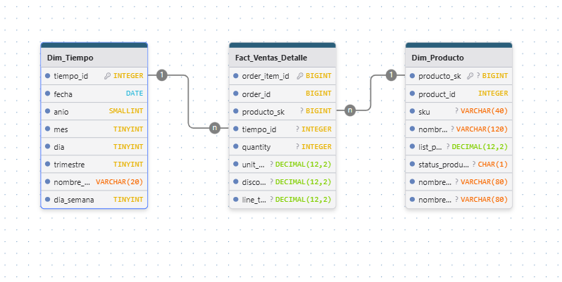

# TP Final — Ecosistema de Datos (EcoBottle AR)

> **Introducción al Marketing Online y los Negocios Digitales — Trabajo Práctico Final**  
> Mini–ecosistema de datos comercial (online + offline) + dashboard de KPIs.

## 0) Contenidos
- [0) Contenidos](#0-contenidos)
- [1) Descripción y Objetivos](#1-descripción-y-objetivos)
- [2) Diccionario de Datos y Modelo](#2-diccionario-de-datos-y-modelo)
- [3) Estructura del Repositorio](#3-estructura-del-repositorio)
- [4) Requisitos e Instalación](#4-requisitos-e-instalación)
- [5) Pipeline ETL (scripts)](#5-pipeline-etl-scripts)
- [6) Cómo ejecutar el proyecto](#6-cómo-ejecutar-el-proyecto)
- [7) Buenas prácticas de repositorio](#8-buenas-prácticas-de-repositorio)
- [8) Créditos y Licencia](#9-créditos-y-licencia)

---

## 1) Descripción y Objetivos 🎯

Este proyecto implementa un *data warehouse* (DW) liviano en formato CSV a partir de datos RAW provistos, y construye un tablero con **KPIs** para el área comercial: **Ventas**, **Usuarios Activos**, **Ticket Promedio**, **NPS**, **Ventas por Provincia** y **Ranking Mensual por Producto**. El caso de uso es **EcoBottle AR** (ventas online y 4 tiendas físicas).

**Entregables principales**:
- Scripts de carga/transformación (ETL) que generan dimensiones y hechos en `DW/`.
- **README** (este documento) con instrucciones, supuestos, diccionario y consultas.
- **Dashboard** final en Power BI con filtros por fecha, canal, provincia y producto.

### 📊 ¡Dashboard Interactivo y Entregable Final!
El proyecto culmina con un dashboard interactivo hosteado, permitiendo el análisis y filtro de los KPIs clave.

* [**Dashboard Interactivo (Power BI) 👈**](https://app.powerbi.com/groups/me/reports/62feaee1-58c4-4753-9a16-7a0454ba3253/f43c76e2f23b21d976f0?experience=power-bi)


* **Capturas Principales:**


---

## 2) Diccionario de Datos y Modelo 🔑

A continuación, se detalla el Esquema Estrella (modelo Kimball) diseñado para este proyecto. Se definen los supuestos clave, las dimensiones de conformación y las tablas de hechos que almacenarán las métricas del negocio.

#### 🧠 Supuestos y Decisiones de Modelado

1.  **Claves (Keys):**

    * **Surrogate Keys (SK):** Se generan claves sustitutas (ej: `cliente_sk`, `producto_sk`) para las dimensiones principales (`Dim_Cliente`, `Dim_Producto`, `Dim_Geografia`). Esto permite manejar cambios a lo largo del tiempo (Slowly Changing Dimensions) y desvincular el DW de las claves operacionales de `RAW`.
    * **Business Keys (BK):** Se conservan las claves originales (ej: `customer_id`, `product_id`) como atributos en las dimensiones para trazabilidad y referencia.
    * **Fact Keys:** Las tablas de hechos usan las PK originales del sistema `RAW` (ej: `order_id`, `session_id`) como su propia Primary Key, ya que el grano es el mismo.

2.  **Dimensión de Tiempo (`Dim_Tiempo`):**

    * Esta es una **dimensión de conformación** generada por el script de ETL, ya que no existe en los datos `RAW`.
    * Todas las tablas de hechos se vinculan a esta dimensión a través de sus respectivos campos de fecha (ej: `order_date`, `started_at`, `paid_at`).
    * La PK (`tiempo_id`) es un entero con formato `YYYYMMDD` para facilitar los `JOINs`.

3.  **Manejo de Nulos / Anónimos:**

    * Las tablas `web_session` y `nps_response` permiten un `customer_id` nulo.
    * Para manejar esto, `Dim_Cliente` contendrá un registro especial (ej: `cliente_sk = -1`) con el valor "Cliente Desconocido / Anónimo". Las FKs en `Fact_Sesiones` y `Fact_NPS` apuntarán a este registro cuando el `customer_id` sea `NULL`.

4.  **Denormalización en Dimensiones:**

    * **`Dim_Producto`:** Se denormaliza uniendo `product` con `product_category` para incluir el nombre de la categoría y su padre en la misma fila.
    * **`Dim_Geografia`:** Se denormaliza uniendo `address` con `province` para tener la información de provincia directamente en la dimensión geográfica.

5.  **Definición de KPIs (Dominios):**

    * **Ventas ($M):** Se calculan como `SUM(total_amount)` de `Fact_Pedidos` donde el `status` sea 'PAID' o 'FULFILLED'.
    * **Usuarios Activos (nK):** `COUNT(DISTINCT cliente_sk)` de `Fact_Sesiones`. Se excluye al cliente "Desconocido".
    * **Ticket Promedio ($K):** `SUM(total_amount) / COUNT(DISTINCT order_id)` para los pedidos con status 'PAID' o 'FULFILLED'.
    * **NPS (ptos.):** `((Promotores - Detractores) / Total Respuestas) * 100`. (Promotores: 9-10, Detractores: 0-6).

---

### DIMENSIONES (Dims)

Estas tablas describen el contexto ("quién, qué, dónde, cuándo") de los hechos.

#### Dim_Tiempo
* **PK:** `tiempo_id` (INT)
* **Atributos:** `fecha` (DATE), `anio` (SMALLINT), `mes` (TINYINT), `nombre_mes` (VARCHAR), `dia` (TINYINT), `trimestre` (TINYINT), `dia_semana` (TINYINT).

#### Dim_Cliente
* **PK:** `cliente_sk` (BIGINT AUTO_INCREMENT)
* **Atributos:** `customer_id` (INT, Business Key), `email` (VARCHAR), `first_name` (VARCHAR), `last_name` (VARCHAR), `phone` (VARCHAR), `status` (CHAR), `created_at` (TIMESTAMP).

#### Dim_Geografia
* **PK:** `geografia_sk` (BIGINT AUTO_INCREMENT)
* **Atributos:** `address_id` (INT, Business Key), `line1` (VARCHAR), `line2` (VARCHAR), `city` (VARCHAR), `postal_code` (VARCHAR), `country_code` (CHAR), `nombre_provincia` (VARCHAR).

#### Dim_Producto
* **PK:** `producto_sk` (BIGINT AUTO_INCREMENT)
* **Atributos:** `product_id` (INT, Business Key), `sku` (VARCHAR), `nombre_producto` (VARCHAR), `list_price` (DECIMAL), `status_producto` (CHAR), `nombre_categoria` (VARCHAR), `nombre_categoria_padre` (VARCHAR).

#### Dim_Canal
* **PK:** `canal_id` (INT)
* **Atributos:** `code` (VARCHAR), `name` (VARCHAR).

#### Dim_Tienda
* **PK:** `tienda_id` (INT)
* **Atributos:** `nombre_tienda` (VARCHAR), `line1` (VARCHAR), `line2` (VARCHAR), `city` (VARCHAR), `postal_code` (VARCHAR), `country_code` (CHAR), `nombre_provincia` (VARCHAR).

---

### HECHOS (Facts)

Estas tablas registran los procesos de negocio y sus métricas. La consigna pide crear todas las tablas de hechos posibles.

#### 1. Fact_Pedidos
Registra las cabeceras de las órdenes de venta. Es la fuente principal para el KPI de Ventas Totales y Ticket Promedio.


* **Grano:** Una fila por cabecera de pedido (`sales_order`).
* **Dimensiones (FKs):** 
    * `tiempo_id` (ref: `Dim_Tiempo`, por `order_date`)
    * `cliente_sk` (ref: `Dim_Cliente`)
    * `canal_id` (ref: `Dim_Canal`)
    * `tienda_id` (ref: `Dim_Tienda`, NULO si es online)
    * `geografia_billing_sk` (ref: `Dim_Geografia`, por `billing_address_id`)
    * `geografia_shipping_sk` (ref: `Dim_Geografia`, por `shipping_address_id`)
    * **Medidas:** `subtotal`, `tax_amount`, `shipping_fee`, `total_amount`.
* **Atributos Degenerados:** `order_id` (PK), `status`, `currency_code`.

#### 2. Fact_Ventas_Detalle
Registra el detalle de productos en cada orden. Es la fuente para el Ranking de Productos.

* **Grano:** Una fila por ítem de producto dentro de un pedido (`sales_order_item`).
* **Dimensiones (FKs):**
    * `order_id` (ref: `Fact_Pedidos.order_id`)
    * `producto_sk` (ref: `Dim_Producto`)
    * `tiempo_id` (ref: `Dim_Tiempo`, por `order_date` de la cabecera)
* **Medidas:** `quantity`, `unit_price`, `discount_amount`, `line_total`.
* **Atributos Degenerados:** `order_item_id` (PK).

#### 3. Fact_Pagos
Registra las transacciones de pago asociadas a las órdenes.

* **Grano:** Una fila por transacción de pago (`payment`).
* **Dimensiones (FKs):**
    * `order_id` (ref: `Fact_Pedidos.order_id`)
    * `tiempo_id` (ref: `Dim_Tiempo`, por `paid_at`)
* **Medidas:** `amount`.
* **Atributos Degenerados:** `payment_id` (PK), `method`, `status`, `transaction_ref`.

#### 4. Fact_Envios
Registra la información logística de los envíos.

* **Grano:** Una fila por envío (`shipment`).
* **Dimensiones (FKs):**
    * `order_id` (ref: `Fact_Pedidos.order_id`)
    * `tiempo_shipped_id` (ref: `Dim_Tiempo`, por `shipped_at`)
    * `tiempo_delivered_id` (ref: `Dim_Tiempo`, por `delivered_at`)
* **Medidas:** `dias_en_transito` (Calculada en ETL: `delivered_at` - `shipped_at`).
* **Atributos Degenerados:** `shipment_id` (PK), `carrier`, `tracking_number`, `status`.

#### 5. Fact_Sesiones
Registra las sesiones de navegación web. Es la fuente para el KPI de Usuarios Activos.

* **Grano:** Una fila por sesión web (`web_session`).
* **Dimensiones (FKs):**
    * `cliente_sk` (ref: `Dim_Cliente`, puede ser "Desconocido")
    * `tiempo_id` (ref: `Dim_Tiempo`, por `started_at`)
* **Medidas:** `contador_sesion` (Valor: 1), `duracion_sesion_seg` (Calculada en ETL: `ended_at` - `started_at`).
* **Atributos Degenerados:** `session_id` (PK), `source`, `device`.

#### 6. Fact_NPS
Registra las respuestas a las encuestas de Net Promoter Score.

* **Grano:** Una fila por respuesta de encuesta (`nps_response`).
* **Dimensiones (FKs):**
    * `cliente_sk` (ref: `Dim_Cliente`, puede ser "Desconocido")
    * `canal_id` (ref: `Dim_Canal`)
    * `tiempo_id` (ref: `Dim_Tiempo`, por `responded_at`)
* **Medidas:** `score`.
* **Atributos Degenerados:** `nps_id` (PK), `comment` (TEXT).

---

## 3) Estructura del Repositorio 📂

```
.
├── README.md
├── LICENSE                 # opcional
├── requirements.txt
├── .gitignore
├── ETL/                    # tus scripts de carga/transformación
│   ├── 01_crear_dim_tiempo.py
│   ├── 02_crear_dimensiones.py
│   └── 03_crear_hechos.py
│
├── star_schema/            # documentación del modelo estrella
│   ├── Fact_Pedidos.png
│   ├── Fact_Ventas_Detalle.png
│   ├── Fact_Pagos.png
│   ├── Fact_Envios.png
│   ├── Fact_Sesiones.png
│   ├── Fact_NPS.png
│   └── ddl/                #  .sql de creación de dims/facts
│       ├── Dim_/*.sql
│       └── Fact_/*.sql
├── raw/                    # datos originales (SOLO LECTURA)
│   └── ...csv
│
├── DW/                     # salidas generadas por ETL (no tocar a mano)
│   ├── Dim_*.csv
│   └── Fact_*.csv
│
├── assets/                 # imágenes para README / capturas del dashboard y DER
    └── dashboard1.jpg
    └── dashboard2.jpg
    └── DER.png
    └── Logo.jpg
```

> **Importante:** asegurate de que todos los CSVs provistos estén bajo `raw/` antes de ejecutar los scripts.

---

# 4) Requisitos e Instalación ⚙️

**Versión recomendada de Python:** 3.10+  
**SO:** Windows / macOS / Linux

### Entorno virtual (recomendado)
```bash
python -m venv .venv
# Windows
.venv\\Scripts\\activate
# macOS / Linux
source .venv/bin/activate
```

### Dependencias
```text
# requirements.txt
# Core (used by all ETL scripts)
pandas>=2.2,<3.0
tabulate

# Optional: run SQL analytics directly on CSVs (not required for ETL run)
duckdb>=1.0.0
```

Instalación:
```bash
pip install -r requirements.txt
```

---

# 5) Pipeline ETL (scripts) 🔄

1) **crear_dim_tiempo.py**  
Genera la tabla `DW/Dim_Tiempo.csv` con atributos de fecha (id `YYYYMMDD`, año, mes, nombre de mes, día, trimestre, día de semana). Respeta rango `START_DATE`–`END_DATE`.  
Variables clave:
- `START_DATE = "2023-01-01"`  
- `END_DATE   = "2025-12-31"`  
- `OUTPUT_DIR = "DW"`  
- `OUTPUT_FILE = os.path.join(OUTPUT_DIR, "Dim_Tiempo.csv")`

2) **crear_dimensiones.py**  
Crea las dimensiones a partir de los CSV de `raw/`:
- **Dim_Canal** (`channel.csv` → `canal_id`, `canal_code`, `canal_nombre`)  
- **Dim_Cliente** (`customer.csv` → genera `cliente_sk` incremental, agrega fila *Cliente Anónimo* con `cliente_sk=-1`)  
- **Dim_Geografia** (`address.csv` + `province.csv` → agrega `nombre_provincia`, genera `geografia_sk`)  
- **Dim_Producto** (`product.csv` + `product_category.csv` + categoría padre → `producto_sk`, `nombre_categoria`, `nombre_categoria_padre`)  
- **Dim_Tienda** (`store.csv` + *lookup* de `Dim_Geografia` para `geografia_sk`)  

3) **crear_hechos.py**  
Genera los hechos consumiendo dimensiones y tablas RAW:
- **Fact_Pedidos** (convierte `order_date` a `tiempo_id`, mapea `customer_id` a `cliente_sk`, `billing/shipping` a `geografia_*_sk`).
- **Fact_Ventas_Detalle** (une con `Fact_Pedidos` para traer `tiempo_id` del pedido y mapea `product_id` a `producto_sk`).
- **Fact_Pagos** (convierte `paid_at` a `tiempo_id`).
- **Fact_Envios** (convierte `shipped_at`/`delivered_at` y calcula `dias_en_transito`).
- **Fact_Sesiones** (convierte `started_at` a `tiempo_id`, mapea `customer_id` a `cliente_sk` y usa `-1` para anónimos; calcula `duracion_sesion_seg` y `contador_sesion=1`).
- **Fact_NPS** (convierte `responded_at` a `tiempo_id`, mapea `customer_id` a `cliente_sk` y renombra `channel_id` → `canal_id`).

4) **main.py** (Orquestador Principal)
Script para ejecutar el pipeline ETL completo. Llama secuencialmente a las funciones de los scripts anteriores (Tiempo, Dimensiones, Hechos) para poblar el Data Warehouse.
Variables clave (pasadas por terminal):
- `--start`: Fecha de inicio (ej: "2022-01-01") para la `Dim_Tiempo`.
- `--end`: Fecha de fin (ej: "2026-12-31") para la `Dim_Tiempo`.

---

## 6) Cómo ejecutar el proyecto 🚀
```bash
# 1) Asegurá los CSV de RAW en ./raw

# 2) Ejecutá el pipeline ETL completo con el orquestador:
# (Esto corre los 3 pasos: Tiempo, Dimensiones y Hechos)
python ETL/main.py --start "2023-01-01" --end "2025-12-31"

# Opcional: podés omitir las fechas y usará las definidas
# por defecto dentro del script 'main.py'
# python ETL/main.py
```
---

## 7) Buenas prácticas de repositorio 👍

- **Entorno virtual** y `requirements.txt` versionado.
- **Conventional Commits** (ejemplo):
  - `feat(etl): agrega cálculo de dias_en_transito en Fact_Envios`
  - `fix(dim_producto): corrige nulos en nombre_categoria`
  - `docs(readme): agrega instrucciones de Power BI`
- **Estructura clara de carpetas** (`raw/`, `DW/`, `ETL/`, `star_schema/`, `assets/`).
- **Control por consola**: creación de ramas, commits, *tags* de entregas, *merge* sin fast-forward cuando aplique.

---

## 8) Créditos y Licencia 🧑‍💻

- **Autor/a**: Lautaro Sanfilippo 
- **Materia**: Introducción al Marketing Online y los Negocios Digitales  
- **Licencia**: MIT

---
